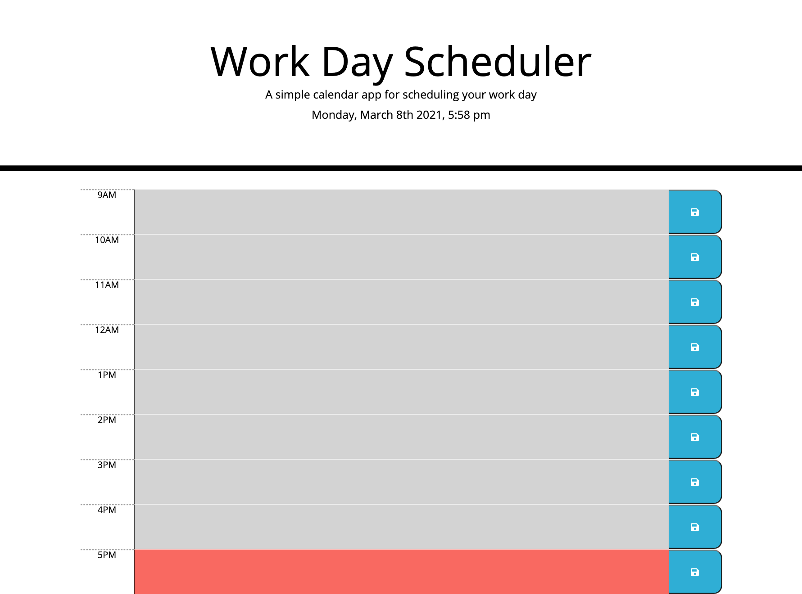

# 05 Third-Party APIs: Work Day Scheduler


[Github Repository](https://github.com/kylegrabski/Work-Day-Scheduler)
<br>
[Web Application](https://kylegrabski.github.io/Work-Day-Scheduler/)

<br><br>

Enter text in the center column, click on the corresponding blue SAVE button to save the text.

<br>

```md
WHEN I open the planner
THEN the current day is displayed at the top of the calendar

WHEN I scroll down
THEN I am presented with timeblocks for standard business hours

WHEN I view the timeblocks for that day
THEN each timeblock is color coded to indicate whether it is in the past, present, or future

WHEN I click into a timeblock
THEN I can enter an event

WHEN I click the save button for that timeblock
THEN the text for that event is saved in local storage

WHEN I refresh the page
THEN the saved events persist
```

<br>


